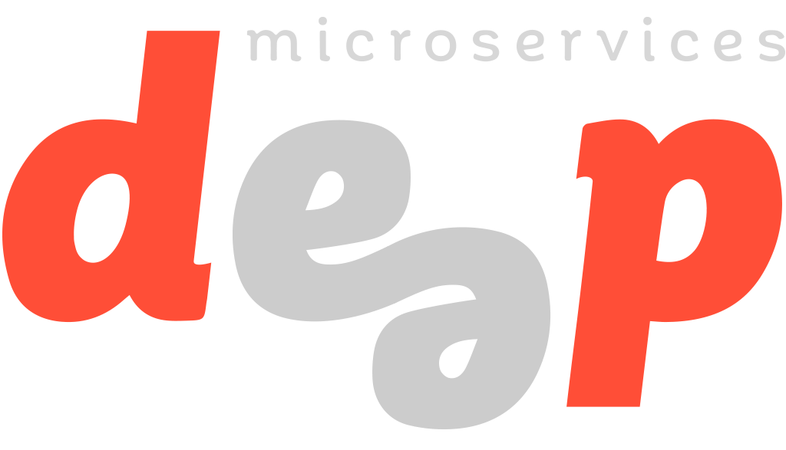

DEEP Microservices Root AngularJS
=================================

[](https://npmjs.org/package/deep-microservices-root-angularjs)
[](https://travis-ci.org/MitocGroup/deep-microservices-root-angularjs)
[](https://www.codacy.com/app/MitocGroup/deep-microservices-root-angularjs)
[](https://coveralls.io/github/MitocGroup/deep-microservices-root-angularjs)



## Digital Enterprise End-to-end Platform

[DEEP](https://github.com/MitocGroup/deep), also known as Digital Enterprise End-to-end Platform, enables businesses and developers to achieve more by doing less. DEEP is low cost and low maintenance digital platform powered by abstracted services from AWS. [DEEP Framework](https://github.com/MitocGroup/deep) abstracts the cloud services functionality and makes it easy to use and developer friendly.

DEEP is using [microservices architecture](https://en.wikipedia.org/wiki/Microservices) on serverless environments from cloud providers like AWS. [DEEP Microservice](docs/microservice.md) is the predefined structure of a microservice (an application) in DEEP. There is clear separation between frontend, backend and database, as well as unit tests and documentation.

> [DEEP Marketplace](https://www.deep.mg) (aka [www.deep.mg](https://www.deep.mg)) is a web application built using DEEP and published on serverless environment from [Amazon Web Services](https://aws.amazon.com) (aka [aws.amazon.com](https://aws.amazon.com)). We make it faster and easier for developers to build and publish their software, as well as for businesses to discover and test applications they are looking for. Our goal is to connnect businesses with developers, and empower technical teams to build self-service software that none technical teams could use. The marketplace is like Apple's App Store or Google's Play for web applications that run natively on cloud providers like AWS.

### How to add AgularJS module

**DeepNgRoot** is a root micro-service which provides [AngularJS](https://angularjs.org/) and [AngularUI Router](https://github.com/angular-ui/ui-router) module.

It automatically loads each bootstrap.js micro-service and attaches the angular module declared.

To connect your angular module you have to export the function with the name of the angular module as _default_.

> The exported function must return _Promise_.

```javascript
export default function moduleName() {
  return System.import('angular_module.js');
};
```
### Hooks

The functions exported by a third-party micro services are executed before load AngularJS and its modules .

> All hooks are optional

**configLoad** - The function to load the settings for the remaining scripts. Performed first.

> The exported function must return _Promise_.

```javascript
export function configLoad() {
  return System.import('deep.core/js/config.core.js');
}
```

**loadFirst** - The function to load scripts before AngularJS.

> The exported function must return _Promise_.

```javascript
export function loadFirst() {
  let scripts = [
    Promise.resolve(System.import('jquery')),
    Promise.resolve(System.import('velocity')),
  ];

  return Promise.all(scripts);
}
```

### Dynamic page title

To set page title you have specify pageTitle parameter in the ui-router config as shown in example.

```javascript
angular.module('moduleName').config(function($stateProvider, $urlRouterProvider) {
$urlRouterProvider.otherwise('/home');
$stateProvider
    .state('home', {
        url: '/home',
        templateUrl : 'home.html',
        data : { pageTitle: 'Home' }
    });
});
```
